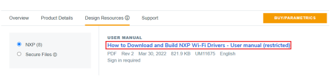
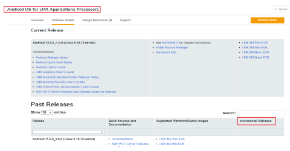

[Link to index page](../index.md)

# Downloading the wireless driver and firmware

## Pre-compiled Wi-Fi driver and firmware

The Android BSP image includes the wireless firmware and pre-compiled driver modules on the following paths:

-   Driver modules: */vendor/lib/modules/*
-   Firmware binary: */vendor/firmware/*

**Note:** The pre built images in Android release  include the following default wireless firmware based on the i.MX 8M EVK boards. The table lists the possible combinations.

|EVK board|Default wireless firmware support|
|---------|---------------------------------|
|i.MX 8ULP EVK board|IW416|
|i.MX 8M Nano/Nano UL EVK board|88W8987|
|i.MX 8M Mini EVK board|88W8987, IW612|
|i.MX 8M Plus EVK board|88W8997 PCIe - UART|
|i.MX 8M Quad EVK board|88W9098 PCIe - UART|
|i.MX 8QM/8QXP EVK board|88W9098 PCIe - UART|

For non-default firmware, build the BSP image from source. For example, refer to the section *Building the image from source*, and the section *Enabling SDIO on M.2 connection in Android* in [UM11483](references.md).

## Wi-Fi driver source and firmware

To download the release for the Wi-Fi driver and wireless firmware, refer to [UM11675](references.md).

For example, go to 88W8997 product page on NXP website, and look for the documentation section:

**Wi-Fi® + Bluetooth® &gt; 88W8997 &gt; Documentation**

**Note:**

-   UART driver source code is open source and part of the Linux kernel source.
-   UART driver source code used for Bluetooth is NOT part of the release package. Download the code from [kernel.org](https://git.kernel.org/pub/scm/linux/kernel/git/gregkh/tty.git/tree/drivers/tty/serial).

## Wi-Fi patch

Intermediate releases are published on [12](references.md#li_android-os-for-imx).

