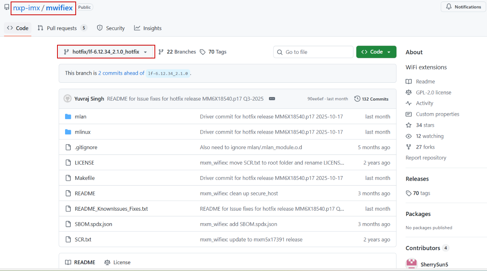

[Link to the index page](../index.md)
# Downloading the wireless driver/utilities and firmware

The following sections provide the information about the latest wireless driver/utility and firmware.

## Pre-compiled Wi-Fi driver and firmware
The Linux BSP image includes wireless firmware and pre-compiled drivers.
- Path to the driver modules: `/lib/modules/<kernel-version>/extra/`
- Path to the firmware binary: `/lib/firmware/nxp/`

## Wi-Fi utilities
The mlan uutility (mlanutl) is not part of the Linux BSP image version v.6.12.34_2.1.0 nor the GitHub source release tag: `lf-6.18.2\_1.0.0`.

To get the source, see [GitHub – mlan utility](references.md).

## Wi-Fi/Bluetooth driver source and firmware
-   To download the Wi-Fi driver and wireless firmware releases, see [UM11675](references.md).
-   To get NXP Bluetooth UART driver and bring up the Bluetooth interface, see [UM11483](references.md).

## Wi-Fi patch
Intermediate fixes are posted on the [GitHub](references.md) repository with "hotfix_" prefix to the release.
The figure shows an example.

